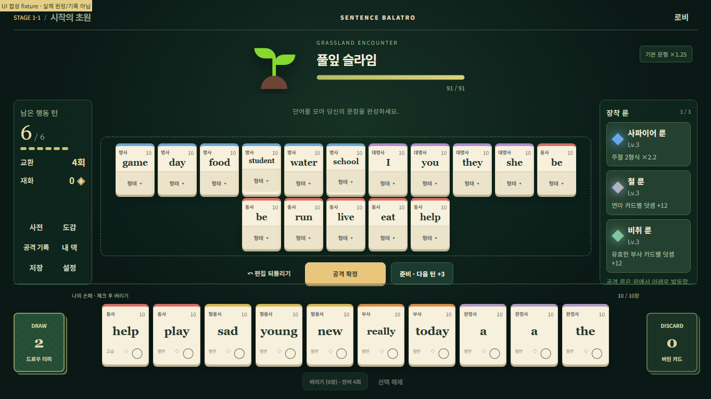
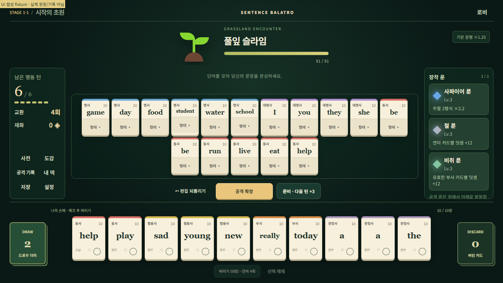

# v0.1.1 source migration and UI layout validation

## Source migration checkpoint — 2026-10-04

- Repository: `YEOMT/grammardealer`; working branch: `codex/source-migration-v0.1.1`.
- Base main: `16f3fb04194943541e7abf99903dce353cb1a41b`. Its history is retained; local backup tag: `backup/main-before-source-v0.1.1-20261004`.
- Source of truth for this initial import: the preserved local v0.1.1 handoff source. The source includes the approved `tests/ui-browser.mjs` `fileURLToPath` correction.
- Source files replace the five deployment-only root files on this development branch. Main is not changed. The manual build artifacts remain recoverable in the base commit and the local backup tag.
- Runtime source, data, package/lockfile, tests and fixtures, specifications, tools and the existing Pages workflow are retained. AGENTS clarifies the pre-merge source baseline and development from latest main after the source migration is merged.
- Generated outputs, duplicate screenshots, downloaded runtimes, caches and local environment dumps are excluded from Git. `docs/evidence-0.1.1/README.md` retains the output directory required by the tests. Original logs, ZIPs and backups remain in the local handoff workspace.
- The public baseline report has personal absolute paths replaced with relative references. Historical PASS results remain historical.

At this import checkpoint the browser suite is **known to fail**: the Windows path error is resolved, but the 1366×768 synthetic maximum-card fixture overlaps the controls and hand. The previous actual result was **11 completed UI check records / 5 screenshots**, then assertion failure. Unit tests (207), data validation (2,251), build and production E2E (6 attacks, three battles) passed in the preceding local execution; these are not yet new-checkout results.

The UI correction and its final verification will be recorded separately from this import commit.

## Deployment boundary

The existing workflow triggers build validation for main-targeted PRs. Uploading the Pages artifact and deploying both require `refs/heads/main` and a non-PR event; deployment also requires a successful build. A development-branch push does not trigger deployment. This migration does not change Pages settings, merge into main, enable auto-merge or publish a site.

## UI correction and final local verification — 2026-10-04

The source import is commit `d2d404b`. Subsequent UI changes affect only `src/ui/styles.css`; game logic, data, markup, test assertions and package/lockfile remain unchanged from that import.

The original failure was reproduced in the new checkout: `node tests/ui-browser.mjs` exited 1 after 11 check records and 5 captures at the 1366×768 maximum-card fixture. The fixed rows had less space than the sentence and controls required. The final CSS gives the combat row a content-based minimum, permits the enemy row to share available space, and uses 8px vertical gutters on short viewports. Size containment on the existing scrolling rune panel prevents its long descriptions from enlarging the whole combat row. Card/button/font sizes and the existing rune/expanded-hand scrolling remain unchanged.

All final commands were executed sequentially on Windows with the existing Node 24.19.0 / npm 11.17.0 / Playwright 1.51.1 / Chromium 134.0.6998.35 environment. The new checkout's dependencies were installed with `npm.cmd ci --offline` from the existing cache and unchanged lockfile.

| Final command | Exit code | Actual result |
|---|---:|---|
| `npm.cmd test` | 0 | 207 passed, 0 failed/skipped |
| `npm.cmd run validate:data` | 0 | 2,251 checks passed |
| `npm.cmd run build` | 0 | Production build passed, 39 modules |
| `npm.cmd run test:browser` | 0 | All five scripts passed; final UI: **41 check records / 25 captures** |
| `npm.cmd run test:e2e` | 0 | **14 check records / 6 real UI attacks / all three Stage 1 battles completed** |

The UI results include 1920×1080, 1366×768, 1180×820 and 1024×768, maximum sentence/hand renderer fixtures, mouse/keyboard interactions and Chromium touch emulation. Maximum-card fixtures are synthetic; the production E2E uses real UI play with the actual hand, normal effects at 1366×768, and `/nested/sentence-game/`, including offline progression after the initial resource load and save/load verification.

A separate observation/assertion probe checked all four viewports with both 10- and 14-card hands. In all eight combinations the document stayed within the viewport, attack and exchange controls stayed visible, and the last rune description and last expanded-hand card were reachable by the existing scroll behavior. Status text remained 14px and rune text at least 12px. An earlier CSS candidate passed the official checks but pushed exchange controls below the viewport; it was rejected after visual inspection and is not the final implementation. The original official assertions were never changed.

At 1366×768, the final official capacity check measured the action bottom at 539.59375px and hand top at 547.59375px (8px gap), with document height 768px. Selected captures are from the official UI script at the normal scroll position:

| Before: overlap reproduced | After: separate controls and hand |
|---|---|
|  |  |

[1024×768 with a 14-card hand](validation/source-migration-v0.1.1/after-1024-hand14.png), [portable final results](validation/source-migration-v0.1.1/results.json), and [eight layout/scroll checks](validation/source-migration-v0.1.1/layout-accessibility.json) are retained with the source. Full logs, intermediate candidates and duplicate screenshots remain under ignored `.local-validation/` in the Git checkout; previous handoff evidence remains in the untouched original source folder.

The CSS change intentionally changes the production asset hashes. No game-rule or save-format change was made. The workflow is unchanged and retains its main-only deployment guards. All servers and browser contexts started by this verification were closed.

The requested local verification has no remaining failures. Physical iPad/Android, Firefox/WebKit, a new 1024 production E2E run, exact `/grammardealer/` revalidation of this CSS build, and public deployment remain **NOT RUN**. Existing languageVersion, possessive-meaning/COMPLETE_HINT and pre-battle turn-bonus notice issues remain outside this change.

The branch is ready for PR review based on these local results. Remote CI status must be checked on the PR; local PASS does not claim a remote Actions run or authorize main merge/public deployment.
