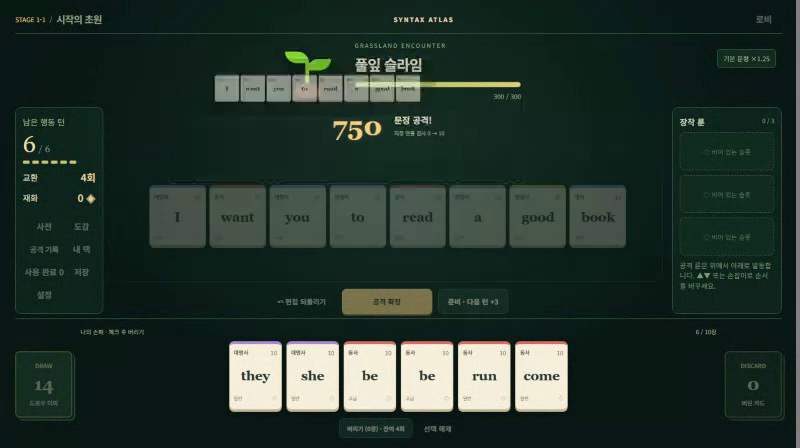
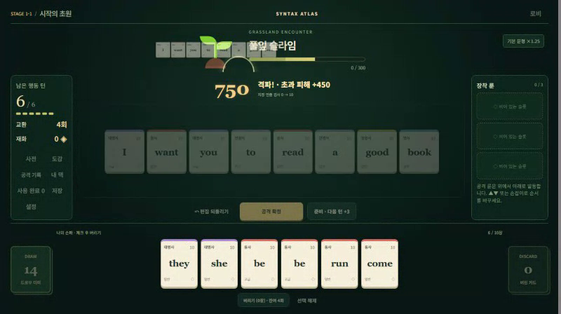
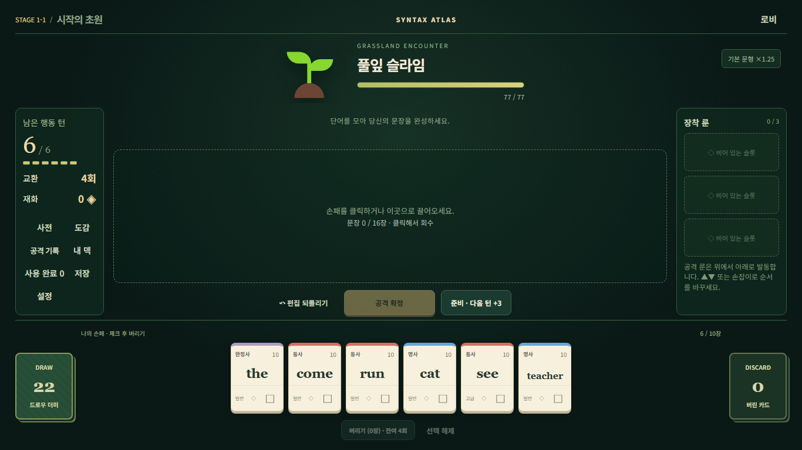
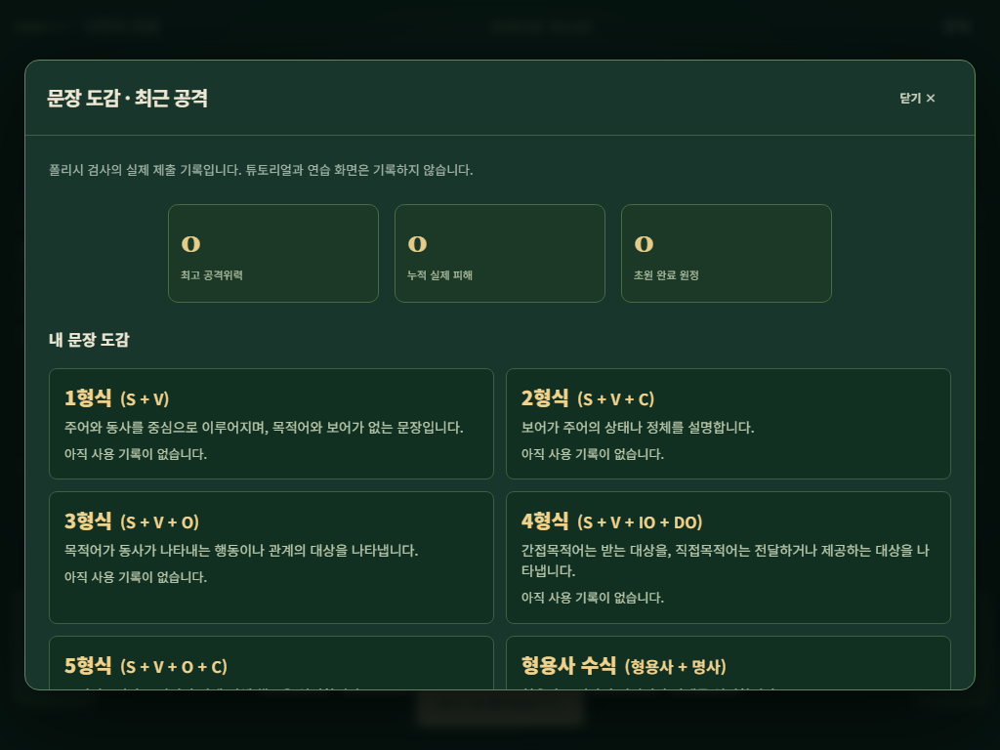
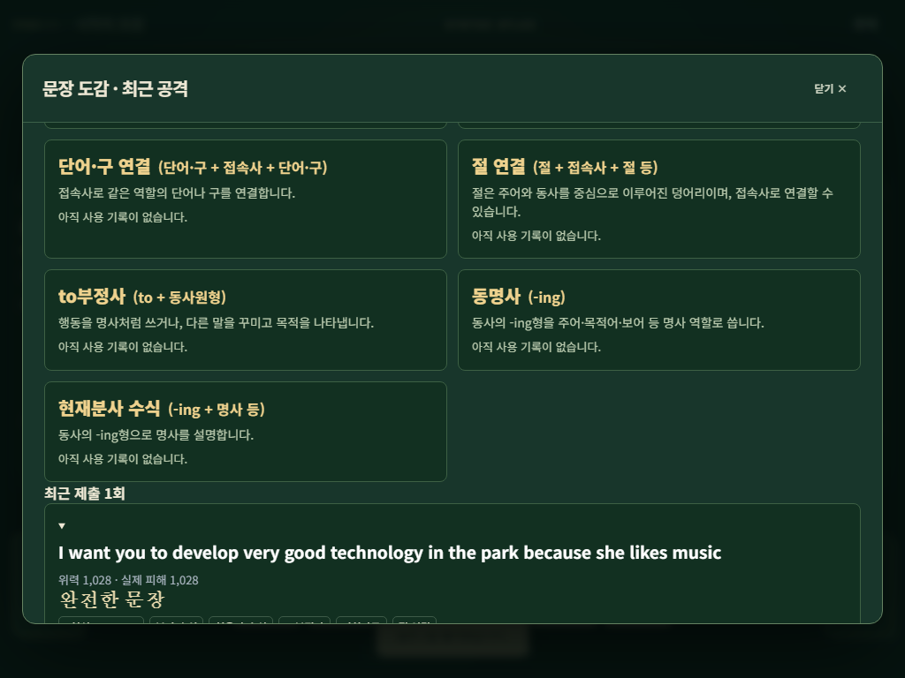
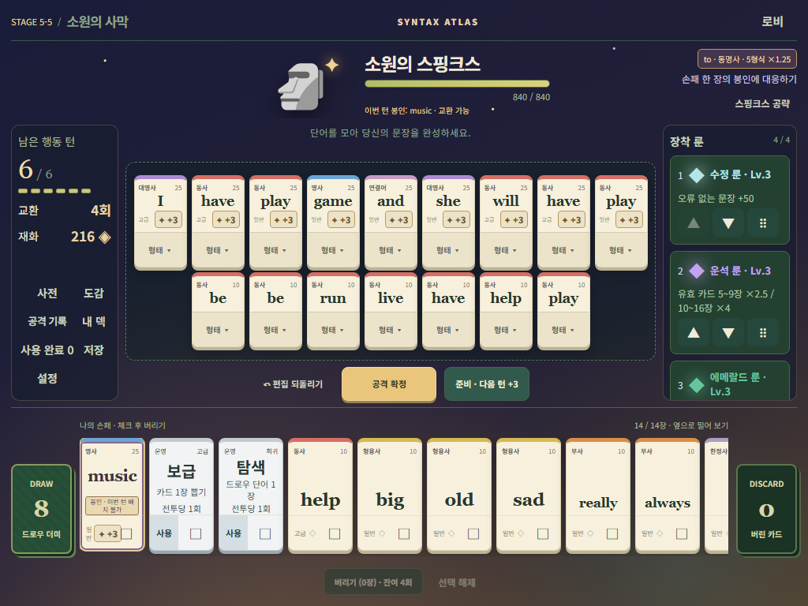
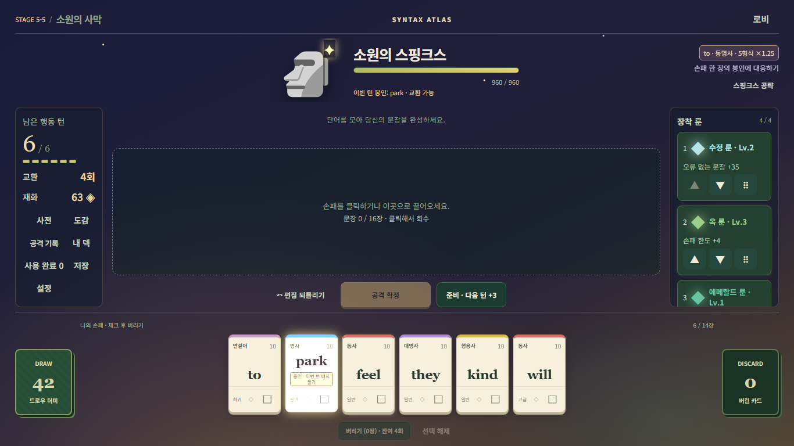
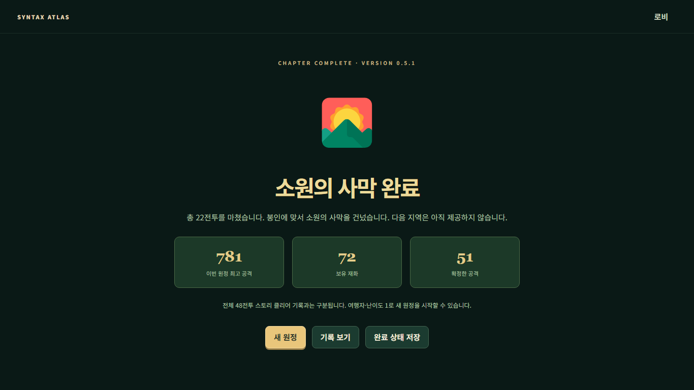

# 0.5.1 실행 증거

이 폴더는 이번 실행의 상대 경로 보고서와 선별 미디어다. 기대 JSON은 `tests/fixtures/v051-*`에 별도로 있으며 그 자체의 NOT_RUN/PASS 상태를 게임 결과로 가져오지 않았다. 상세 실패·수정 이유는 [테스트 보고서](../../TEST_REPORT_0.5.1.md)에 남긴다.

| 자료 | 실제 범위 |
|---|---|
| commands.json | 최종 명령의 종료 코드와 이전 실패 시도 |
| browser-summary.json / 각 browser JSON | 공식 전체·Chromium polish·Firefox/WebKit의 실제 완료 항목 |
| core.json / firefox-core-polish-browser.json / webkit-core-polish-browser.json | 지정 resolution, 실제 native 시계/rAF·DOM 위치/가시성·HP·정리. 전체 원시 프레임은 로컬 보존 |
| production-browser.json / production-actions.json | 스킵 후 실제 production UI22전투. 초기 로딩 후 offline, 저장/보상/상점/운영/보스 포함 |
| source-build.json | 최종 빌드와 production 검사 빌드의 해시 동일성 |
| package-check.json | 실제 production ZIP을 다시 열어 자산·manifest·base·제외 경로 검사 |
| evidence-restoration.json | 이전 고정 증거71개 복원 SHA256 검증 |
| acceptance.json | P001–P089의 실제 근거 연결. 테스트 assertion 개수와 다름 |

[핵심 모션 짧은 영상](core-motion-matrix.webm)은 final3 Chromium native 영상의 첫10초를 재인코딩 없이 추출했다. effects/reduce 매트릭스의 지정 상태 검사이며 실제 자연 원정 영상으로 주장하지 않는다. 게임 src는 final4에서도 동일하고 중간 이동 측정만 중심점으로 바로잡았다. 전체 영상·rAF 원자료는 로컬 `.local-validation/v051/final3/`와 `final4/`에 있다.

production 전체 녹화와39개 PNG는 로컬 `.local-validation/v051/final3/e2e/`에 보존한다. 이 폴더에 중복된 전체 영상·런타임·ZIP·사용자 환경 덤프를 올리지 않는다. 실제 교사/학생, 실 iPad/Android, 스피커 청취, 툴바 확대는 NOT RUN이다. Windows WebKit과 CSS zoom을 실기기 증거로 간주하지 않는다.
